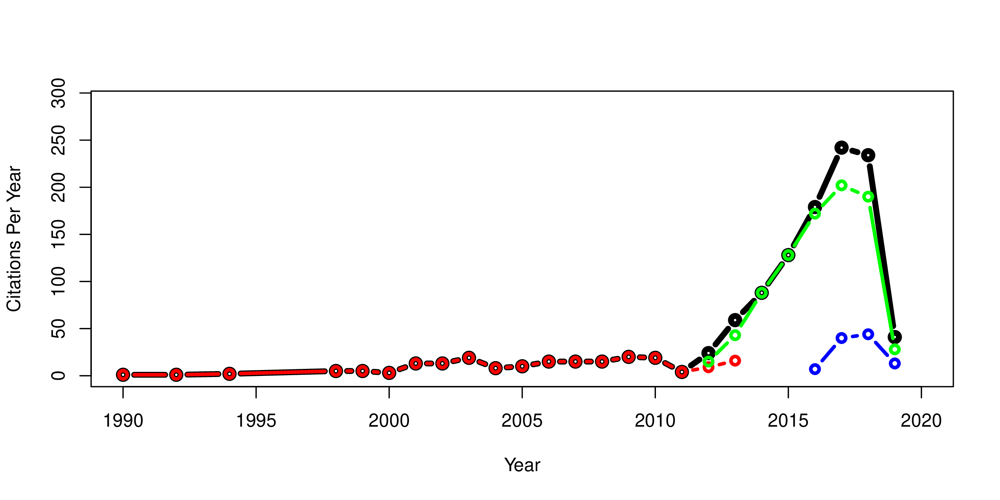
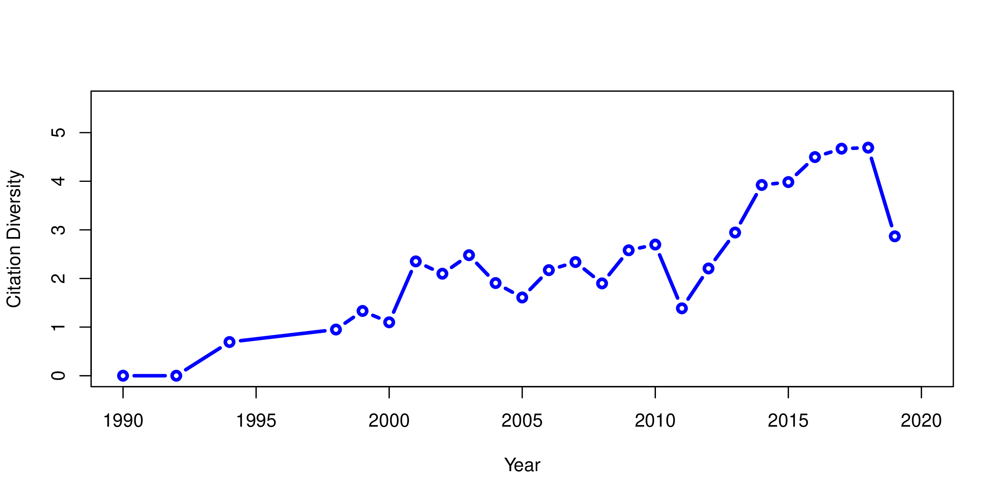

# ADCitations
### Preliminary analysis of automatic differentiation citations in relation to ADMB and TMB open source projects

- Does free, open source, software have more users than proprietary software?
- Does free, open software reach a more diverse audience of of users? 

[AD Model Builder (ADMB)](http://www.admb-project.org/)is a high level programming language derived from C++ that uses [automatic differentiation](http://www.autodiff.org/?module=Introduction&submenu=FAQ) to accomplish stable numerical function minimization. ADMB was originally created and released as proprietary software by Dave Fournier of  [Otter Research Ltd.](http://otter-rsch.com/) Early applications were estimation of parameters in non-linear statistical models in the field of fisheries management. ADMB is a general purpose software package with potential applications in many fields. Rights to the ADMB software were aquired by the [ADMB Foundation](http://admb-foundation.org/) in 2007 for the purpose of creating an open source software project, and the software was made freely available in 2008. Other AD approaches subsequently became available. The release of [CppAD](http://www.autodiff.org/?module=Tools&tool=CppAD) led to the development of [Template Model Builder (TMB)](https://github.com/kaskr/adcomp) by Kasper Kristensen in YEAR. TMB is an open source approach to the use of AD in statistical modeling using C++ templates.

I have attempted to use the citation history of ADMB before and after open source release along with the citation history of TMB to explore the questions above. 

Three citation sources were used:

1. The [ADMB on-line publication list](http://www.admb-project.org/community/bibliography/).

2. Citations of [Fournier, D.A., Skaug, H.J., Ancheta, J., Ianelli, J., Magnusson, A., Maunder, M.N., Nielsen, A., and Sibert, J. 2012. AD Model Builder: using automatic differentiation for statistical inference of highly parameterized complex nonlinear models. Optim. Methods Softw. 27:233-249.](http://tandfonline.com/doi/abs/10.1080/10556788.2011.597854) gleaned from the Web of Science downloaded in March 2019.

3. Citations of Kristensen, K., Nielsen, A., Berg, C.W., Skaug, H.J., and Bell, B.M. 2016. [TMB: Automatic Differentiation and Laplace Approximation. J. Stat. Softw. 70(5):1-21.](https://www.jstatsoft.org/article/view/v070i05) also gleaned from Web of Science in March 2019.

The ADMB on-line publication list is not in a convenient format for automatic processing. The complete list of citations from the ADMB site was copied and pasted into [FreeCite](http://freecite.library.brown.edu/) and downloaded in BibTeX format. The BibTeX file was processed with `sed` to create a second BibTeX file with consistent journal titles. An `awk` script plus a bit of manual editing produced a matrix of citations by journal name and year (`oldADMB_citation_matrix.csv`).

The two Web of Science `.csv` files were first processed by libreoffice to change the field delimiter from ',' to '|' without merging delimiters and processed by an `awk` script to produce citation matrices. (`ADMB_citation_matrix.csv`
and `TMB_citation_matrix.csv`).

The three citation matrixes above were summed by an `awk` script to create a complete citation matrix spanning the period 1990 through 2017.

#### Results

The figure below shows trends in citations per year with the ADMB website list shown in red, citations of Fournier et al (2012) in green, citations of Kristensen et al (2016) in blue, and total citations in black. There are no noticable upticks in number of citations per year corresponding to open-source release dates. Rather, the publication of definitive references seems to be the most important simulus to number of citations per year.

The problem of determining whether the number of citations of a method has expanded into more fields is superficially similar to problems faced by ecologists to express changes in species diversity in different areas and times. The figure below shows the trend in "publication diversity" as measured by the [Shannon Weaver diversity index](https://en.wikipedia.org/wiki/Diversity_index#Shannon_index). It shows a relatively continuous increase from 1990 to 2010 followed by a sharp increase after 2012.

#### Conclusions to date

- Web of Science citations are intended to assist academics achieve tenure and promotion. WOS seems to be constrained to peer-reviewed academic journals. It appears not to include many book chapters, symposia, and technical reports. I have also used [Google Scholar (GS)](https://scholar.google.com/) which serves up a longer list of citations, but it is difficult to download the results in any usable format. GS appears to dig deeper than WOS. I was able to find publications that cite Fournier's original AUTODIF user manual.

- You can't tell much from citation frequency based on the WOS data alone.

- `awk` is an efficient programming language for accumulating generating a citation matrix. The associative arrays allow creation of vectors and matrices indexed by unique journal names and years. The following 7 lines of code are all that are required to process the citations in a WOS citation list.

       ncite ++
       i = toupper($jf)
       gsub(",","",i)
       journal_count[i] ++
       j = $yf
       year_count[j] ++
       cite_matrix[i][j] ++

#### To Do
- Compare list of most frequent 5 (or 10) journal names prior to 2008 to the list after 2008

- Explore ways to utilize the citations generated by Google Scholar.

- scholar.py is a parser for Google Scholar, written in Python. GS finds references to older literature and
and also includes technical reports and other "gray literature". 
The original can be found athttps://github.com/ckreibich/scholar.py,
but it does not work very well. The fork found at https://github.com/johnrsibert/scholar.py works a bit better, 
but is usually stopped by Google's to avoid bots. There are workaround.

